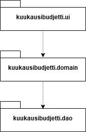
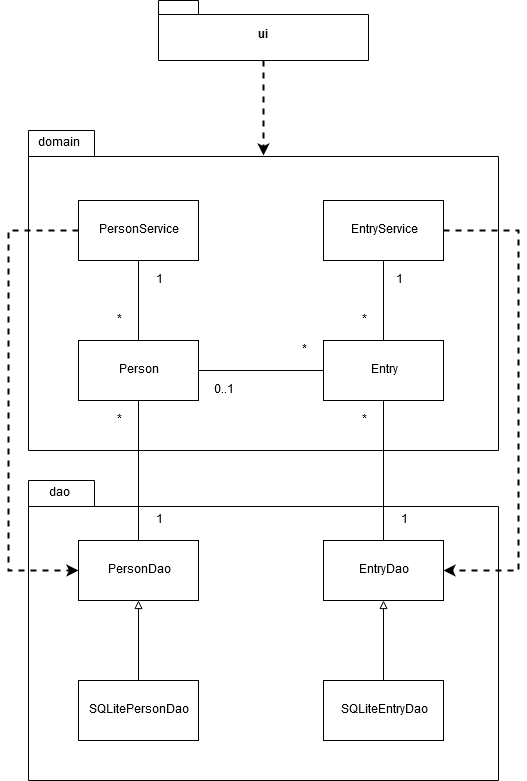
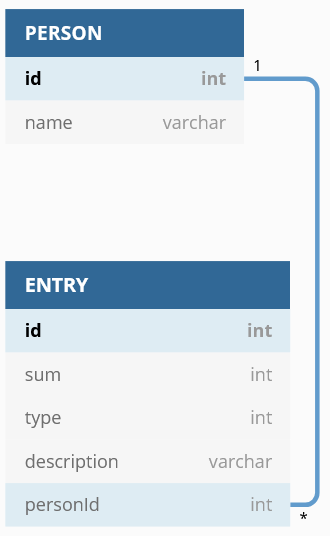
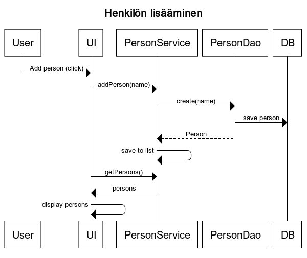
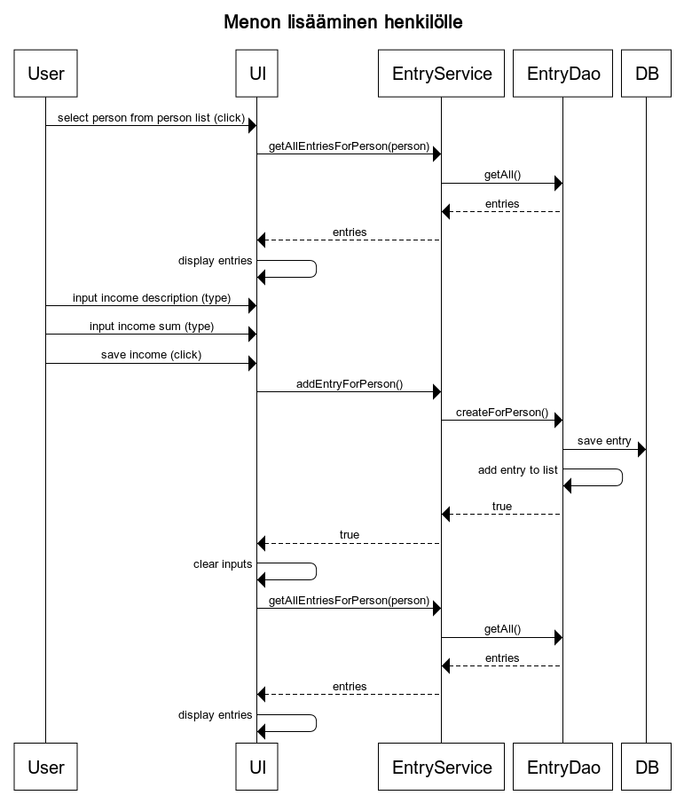
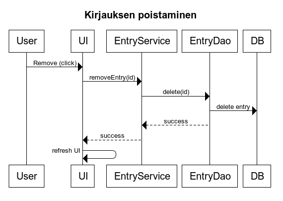

# Arkkitehtuurikuvaus
## Rakenne
Ohjelman rakenne on kolmikerroksinen. Ylin taso on käyttöliittymä (_kuukausibudjetti.ui_), jonka kautta käyttäjä käyttää toimintoja kerrokselta, jota ohjataan käyttöliittymällä (_kuukausibudjetti.domain_). Nämä toiminnot käyttävät tiedon tallennukseen liittyvää kerrosta (_kuukausibudjetti.dao_).

## Käyttöliittymä
Sovelluksen käyttöliittymä sisältää vain yhden näkymän, jonka sisältö päivittyy tarpeen mukaan. Käyttöliittymän rakentaa luokka _kuukausibudjetti.ui.BudgetUI_. Kaikki sovelluslogiikka on ulkoistettu käyttöliittymälle luontivaiheessa osoitetuille _service_-luokille _EntryService_ ja _PersonService_, jollon käyttöliittymä ei sisällä sovelluslogiikka kuin tiedon esittämistä varten tehdyn muotoilun osalta.

## Sovelluslogiikka
Varsinaisia toimintoja käyttäjälle käyttöliittymän kautta tarjoavat luokat _PersonService_ ja _EntryService_. PersonServicen tarkoitus on tarjota uusien henkilöiden luomiseen, hakemiseen ja poistamiseen liittyviä toimintoja. EntryService puolestaan tarjoaa toiminnot budjettikirjausten lisäämiseen, poistamiseen ja hakemiseen.

Ohjelman luokkien välistä suhdetta kuvaa alla oleva pakkauskaavio:

## Budjetin pysyväistallennus
Budjettiin lisätyt henkilöt ja kirjaukset tallennetaan SQLite-tietokantaan, josta relaatiokaavio alla.

Sekä henkilöille että kirjauksille on omat luokkansa tiedon tallentamista varten. Näitä ovat rajapinnan _PersonDao_ toteuttava SQLite-tallennuksen tarjoava _SQLitePersonDao_ ja rajapinnan _EntryDao_ toteuttava SQLite-tallennuksen tarjoava _SQLiteEntryDao_. Nämä luokat injektoidaan niitä käyttäville luokille konstruktoreissa. Näin rajapintoja rikkomatta voitaisiin luoda uusia tallennustoteutuksia ja vaihtaa niitä nykyisten tilalle.

## Päätoiminnallisuudet
Toiminnallisuudet noudattavat varsin vahvasti samaa kaavaa. Käyttäjä tekee toimenpiteen käyttöliittymässä, jolloin tietoa joko lisätään tietokantaan tai poistetaan sieltä. Tämän jälkeen käyttöliittymä päivittää itsensä kutsumalla metodeita esimerkiksi otsakkeiden, tekstien ja listojen päivittämiseksi. Alla kolmen pääasiallisen toiminnallisuuden sekvenssikaaviot. Muut toiminnallisuudet ovat hyvin samankaltaisia, koska sovelluksessa on tällä hetkellä vain lisäys- ja poistotoiminnot.
### Henkilön lisääminen

### Menon lisääminen henkilölle

### Kirjauksen poistaminen

## Ohjelman rakenteeseen jääneet heikkoudet
### Käyttöliittymä
Käyttöliittymä luodaan yhdessä suurehkossa luokassa ja erityisesti vain parissa sen metodissa. Apumetodeita on kyllä runsaasti, mutta eri listoja olisi ehkä voinut erotella omiin luokkiinsa, jotta varsinaisen pääluokan olisi saanut lyhyemmäksi.

### Tietojen käsittely
Lisättyjä henkilöitä ja kirjauksia ei pysty muokkaamaan, jolloin muokatakseen kirjausta tai henkilön nimeä ne joutuu poistamaan ja lisäämään uudelleen. Tämä on erityisen huono asia henkilön poistamisen kohdalla, koska silloin tietokannasta poistuu myös henkilöön liittyvät kirjaukset.