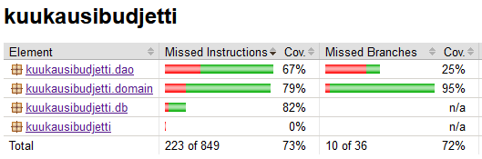

# Testausdokumentti

Ohjelmaa on testattu sekä automatisoiduin yksikkö- ja integraatiotestein JUnitilla.

## Yksikkö- ja integraatiotestaus

### sovelluslogiikka

Pääasiallisesti on testattu kirjausten tekemiseen ja poistamiseen liittyvää luokkaa [EntryServiceTest](https://github.com/Jamb000h/ot-harjoitustyo/blob/master/kuukausibudjetti/src/test/java/kuukausibudjetti/domain/EntryServiceTest.java).

Integraatiotestit käyttävät datan pysyväistallennukseen DAO-rajapinnan keskusmuistitoteutusta [FakeSqliteEntryDao](https://github.com/Jamb000h/ot-harjoitustyo/blob/master/kuukausibudjetti/src/test/java/kuukausibudjetti/domain/FakeSQLiteEntryDao.java).

### DAO-luokat

Molempien DAO-luokkien toiminnallisuus on testattu luomalla testeissä tilapäinen tietokanta hyödyntäen SQLiten tarjoamaa keskusmuistissa vain testien suorituksen ajan olemassa olevaa tietokantaa. [SQLite In-Memory Databases](https://www.sqlite.org/inmemorydb.html).

### Testauskattavuus

Käyttöliittymäkerrosta lukuunottamatta sovelluksen testauksen rivikattavuus on 73% ja haarautumakattavuus 72%

Testaamatta jäi pääasiassa DAO-luokkien tilanteita, joissa metodin try-catch-lohko heittää virheen.

## Järjestelmätestaus

Sovelluksen järjestelmätestaus on suoritettu manuaalisesti.

### Asennus ja konfigurointi

Sovellus on haettu ja sitä on testattu [käyttöohjeen](./kayttoohje.md) kuvaamalla tavalla sekä Windows- että Linux-ympäristöön siten, että sovelluksen käynnistyshakemistossa on ollut käyttöohjeen kuvauksen mukainen _config.properties_-tiedosto.

### Toiminnallisuudet

Kaikki [määrittelydokumentin](./vaatimusmaarittely.md) ja käyttöohjeen listaamat toiminnallisuudet on käyty läpi. Kaikkien toiminnallisuuksien yhteydessä on syötekentät yritetty täyttää myös virheellisillä arvoilla kuten tyhjillä.

## Sovellukseen jääneet laatuongelmat

Sovellus ei anna tällä hetkellä virheilmoituksia lainkaan. Siinä ei myöskään ole muokkaustoimintoa, jolloin käyttäjän ainoa mahdollisuus tiedon muokkaamiseen on poistaminen ja uudelleen lisääminen.
